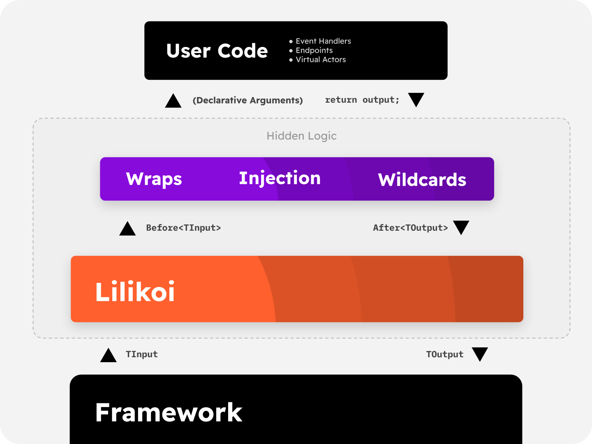

# High Level Overview

Lilikoi is designed to replace expensive reflection logic and deliver a consistent API surface
from the perspective of both framework and framework consumer.

Lilikoi provides APIs for frameworks to define declarative helpers, such as parameter injection
and before/after hooks (called wraps). Additionally, users can specify arbitrary types in the
parameters of their entry point, and Lilikoi will resolve those parameters to a wildcard injection
if one is available.

The **Framework** sees a small API surface where it can request Lilikoi to execute a container
with an arbitrary input and receive an output from that container.

The **User** sees a powerful suite of tools to declaratively describe the resources required
to fulfill an action.

**Both** will see an attribute system where various wraps and injectors can quickly be 
scaffolded to replace repetitive imperative logic.

## Types of Injections

- **Property** injection is for values that are *not* expected to change *behavior* between invocations.
  These should primarily be used for service providers such as database connections.
- **Parameter** injection is for values that are *expected* to change both value and behavior between invocations,
  depending on the input value for the container.
- **Wildcards** are similar to parameter injection, but are detected by the parameter type and not an attribute.
  They have no explicit usage

## Other Attributes

- **Wraps** (also known as "Hooks") allow users to specify additional code to run before and after the entry point using an attribute.
  This can be used to include third-party code that translates the input, mutates the output, or prevents the entry point from executing altogether.
  For example, wraps can be used to add authentication to an API endpoint, or decode a string into it's JSON payload.

- **Mutators** allow you to hook into the Lilikoi container compiler and add your own wraps and wildcards.
  Mutators can be used to add advanced functionality to containers, and even smuggle metadata from the compilation process
  to the final container object using the provided mount interface.

## Headless
Lilikoi has some APIs, called "Headless" APIs, which are designed to be used without the full framework.
These headless APIs can be used to piecemeal implement Lilikoi behavior (or extend lilikoi injection behavior
to parts of the framework that don't already have it). So far only property injection headless APIs are provided,
but headless APIs for all types of injections and attributes is planned.
